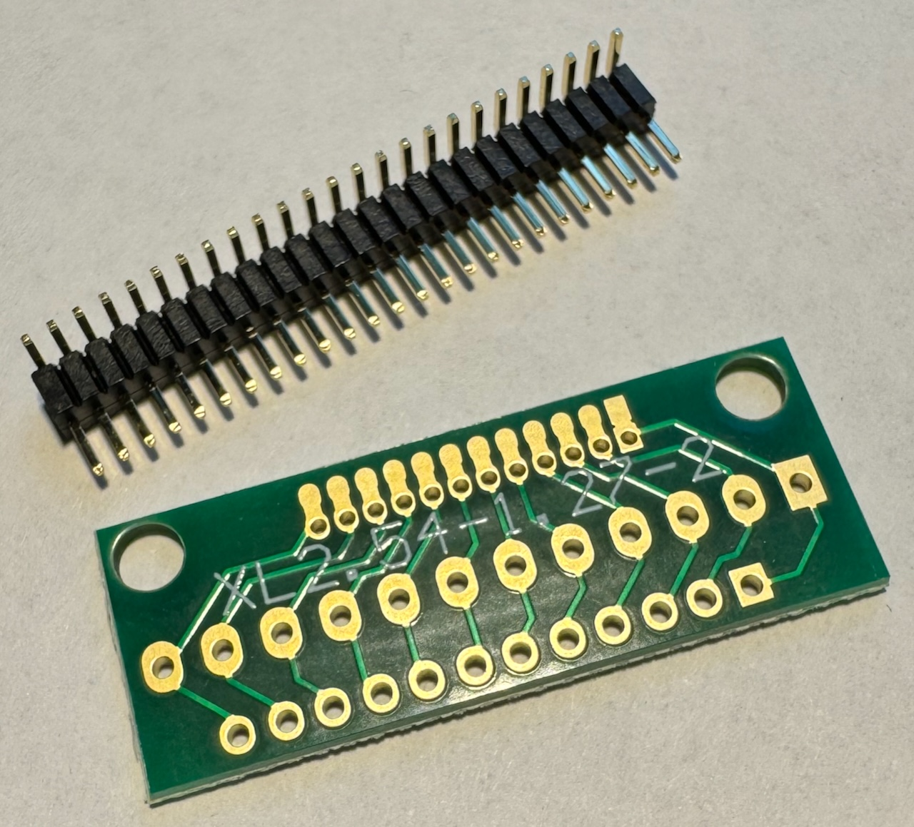
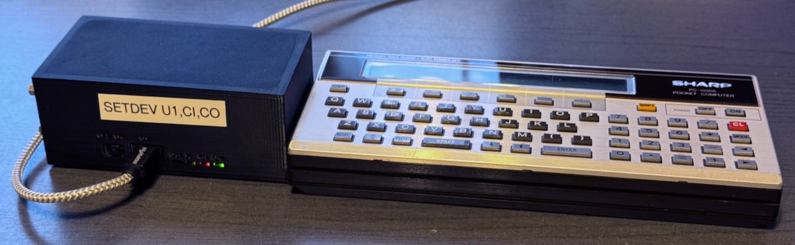

# Hardware for communication

## PC-1600: USB Serial Adapter

The Sharp PC-1600 has a serial device built in. It uses fairly standard 5V logic, and can be interfaced
with currently available FTDI adapters. When using an original (non-cloned) FTDI adapter, no additional
logic chips or inverters are required.

These are the components that I used:

- 1mm pins, bent 90 degrees
- A small board for soldering the pins. Search for "1.27mm 2.54mm Adapter Board" on the merchant site of your choice.
  While I found no 15 pin boards, 12 pins are enough for the signals that are required.
- USB/UART cable, I used this one: "FTDI TTL-232R-5V-WE", i.e. 5V logic and wire ends.

Before the USB / UART adapter can be used, it needs to be reprogrammed using a Windows
machine. The signals of the RX, TX, RTS and CTS pins need to be inverted. This
can be done with a utility provided by FTDI, and is not covered in this README.
This is a one time operation, because the change is persistent even after
unplugging the cable.

The wiring is as follows (pin 1 is the rightmost pin of the PC-1600's 15-pin serial connector):

| Pin | Signal PC-1600 | Connect this cable of the USB/UART | USB/UART wire color |
|-----|----------------|------------------------------------|---------------------|
| 2   | TX             | RX                                 | yellow              |
| 3   | RX             | TX                                 | orange              |
| 4   | RTS            | CTS                                | brown               |
| 5   | CTS            | RTS                                | green               |
| 7   | TX             | Ground                             | black               |

Note: Do not connect the red cable (5V) of the adapter. I simply cut the cable off.

Note that I had to trim the edges of the board, because it would not have fit otherwise:

### Problem with Apple Silicon Mac

On a Mac with the Apple Silicon chip, the USB UART Adapter does not work as it should,
probably due to a bug in the driver. The protocol that is used for flow control
is "RTC/CTS". In this, the sender (i.e. the Mac) requests to send a byte by raising
the RTS line ("request to send"). Then it is supposed to wait until the receiver
(the PC-1600) acknowledges readiness by raising the CTS line ("clear to send").
However, the Mac does not wait and starts to send right away, and the data
is lost. The other direction (PC-1600 to Mac) works fine.

As a workaround, I build the jar on the Mac and send it to a Raspberry Pi via `scp`.
The PC-1600 is connected to the Raspberry Pi, and sending / receiving happens
on the Raspberry Pi via a remote `ssh` session from the Mac.

## PC-1500/A: CE-158X

The PC-1500 does not have a serial port built in. There was an add-on from Sharp
called "CE-158" which provided a serial and a parallel port. The software is not currently
compatible with the original device, but it would not be difficult to change this.

[Jeff Birt](https://github.com/Jeff-Birt) built a modern equivalent of this add-on,
and sells it under the name
[CE-158X](https://www.soigeneris.com/ce-158x-serial-parallel-interface-for-sharp-pc-1500).
This software is tested with the USB port (U1) of the CE-158X.