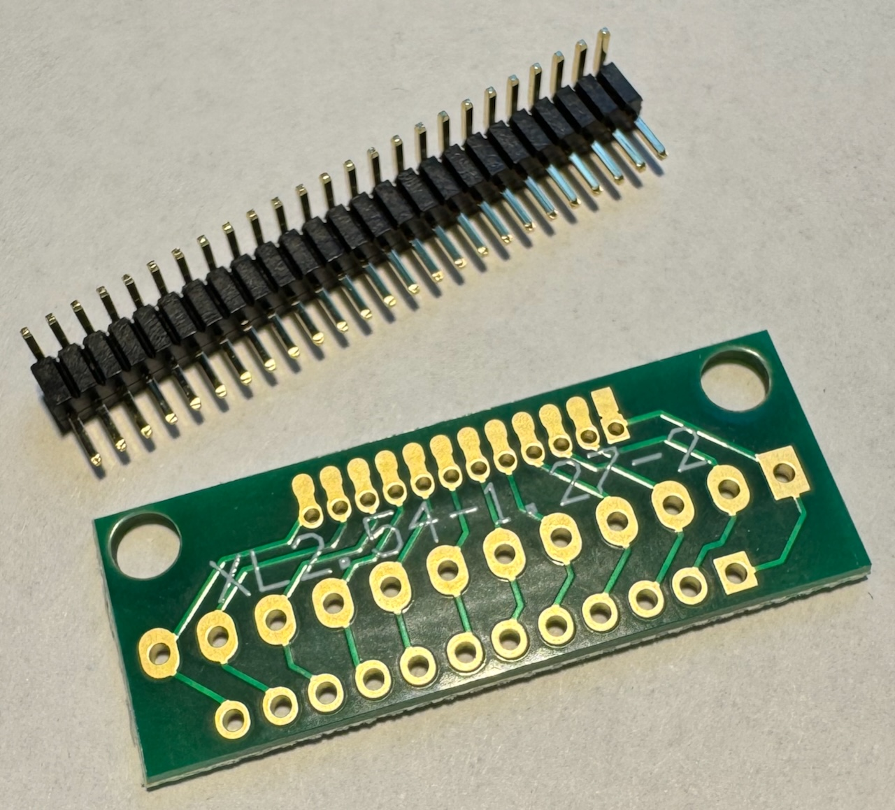
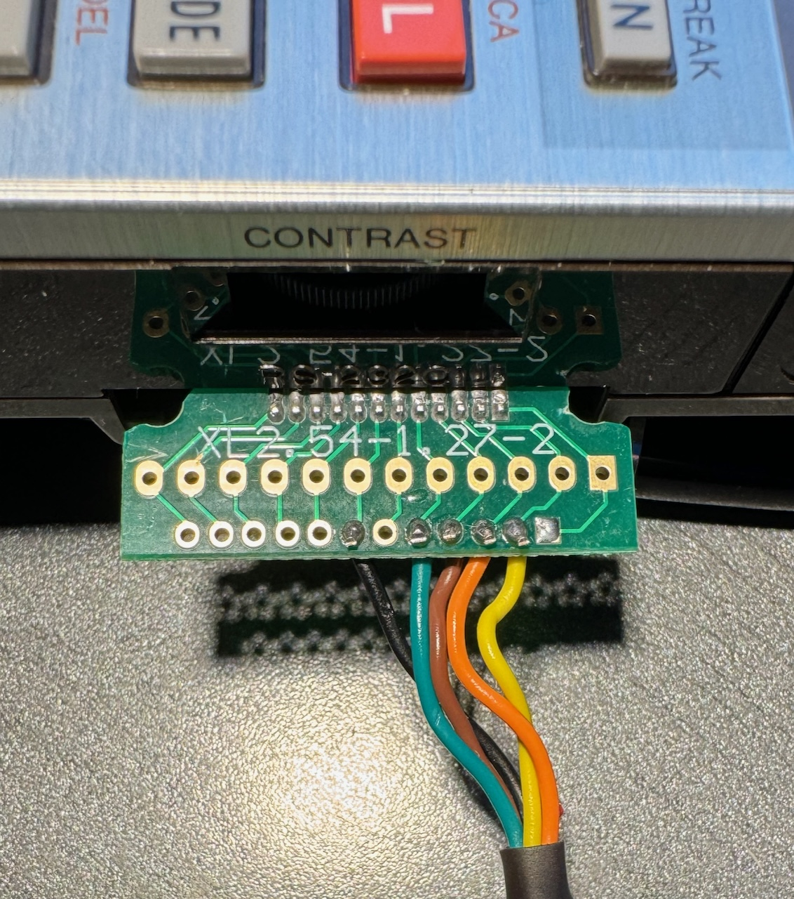

# Sharp Pocket Computer Communicator
The purpose of this program is to safe and load Basic programs that are stored on your computer
from and to Sharp PC-1500 and PC-1600 devices through a _serial interface_.

The program takes care of the peculiarities of the two Pocket Computer devices, such as the different line
ending formats used, or the end of file marker. It also slows down communication if necessary
for the PC-1500, so that it can keep up.


## Serial cable and/or interface
### PC-1600: USB Serial Adapter

The Sharp PC-1600 has a serial device built in. It uses fairly standard 5V logic, and can be interfaced
with currently available FTDI adapters. When using the original FTDI adapter, no additional
logic chips or inverters are required.

These are the components that I used:
* 1mm pins, bent 90 degrees
* A small board for soldering the pins. Search for "1.27mm 2.54mm Adapter Board" on the merchant site of your choice.
While I found no 15 pin boards, 12 pins are enough for the signals that are required.
* USB/UART cable, I used this one: "FTDI TTL-232R-5V-WE", i.e. 5V logic and wire ends.

Before the USB / UART adapter can be used, it needs to be reprogrammed using a Windows
machine. The signals of the RX, TX, RTS and CTS pins need to be inverted. This
can be done with a utility provided by FTDI, and is not covered in this README.
This is a one time operation, because the change is persistent even after
unplugging the cable.

The wiring is as follows (pin 1 is the rightmost pin of the PC-1600's 15-pin serial connector):

| Pin | Signal PC-1600 | Connect this cable of the USB/UART | USB/UART wire color |
|-----|----------------|------------------------------------|---------------------|
| 2   | TX             | RX                                 | yellow              |
| 3   | RX             | TX                                 | orange              |
| 4   | RTS            | CTS                                | brown               |
| 5   | CTS            | RTS                                | green               |
| 7   | TX             | Ground                             | black               |
Note: Do not connect the red cable (5V) of the adapter. I simply cut the cable off.



Note that I had to trim the edges of the board, because it would not have fit otherwise:



#### Problem with M1 Mac
On a Mac with the Apple Silicon chip, the USB UART Adapter does not work as it should,
probably due to a bug in the driver. The protocol that is used for flow control
is "RTC/CTS". In this, the sender (i.e. the Mac) requests to send a byte by raising
the RTS line ("request to send"). Then it is supposed to wait until the receiver
(the PC-1600) acknowledges readiness by raising the CTS line ("clear to send").
However, the Mac does not wait and starts to send right away, and the data
is lost. The other direction (PC-1600 to Mac) works fine.

As a workaround, I build the jar on the Mac and send it to a Raspberry Pi via `scp`.
The PC-1600 is connected to the Raspberry Pi, and sending / receiving happens
on the Raspberry Pi via a remote `ssh` session from the Mac.

### PC-1500/A: CE-158X

The PC-1500 does not have a serial port built in. There was an add-on from Sharp
called "CE-158" which provided a serial and a parallel port. The software is not currently
compatible with the original device, but it would not be difficult to change this.

[Jeff Birt](https://github.com/Jeff-Birt) built a modern equivalent of this add-on,
and sells it under the name
[CE-158X](https://www.soigeneris.com/ce-158x-serial-parallel-interface-for-sharp-pc-1500).
This software works with the USB port (U1) of the CE-158X. See below on how to set-up the
PC-1500 to use the correct port.

## Software
### SharpCommunicator
The Sharp Communicator comes in the form of an executable JAR file. You need
to have Java installed (at least v17), and access to a command line.

The tool is launched as follows:

`java -jar SharpCommunicator.jar <options>`

The options are:
* `--infile (-i)`: Load a file onto the PC-1500/1600. Before launching the tool, enter `LOAD "COM1:"` on the PC-1600, or `CLOAD` / `CLOADa` on the PC-1500.
* `--outfile (-o)`: Save a file from the PC-1500/1600 to the PC. Launch the tool, and then enter `SAVE "COM1:"` / `SAVE "COM1:", A` on the PC-1600, or `CSAVE` / `CSAVEa` on the PC-1500.
  Note that the special filename `clip` is reserved for the clipboard.
* `--informat ascii`: Force the infile to be read as ASCII (default for any `.BAS` file, or when reading from the clipboard).
* `--informat binary`: Force the infile to be read as binary (default for any file except `.BAS`)
* `--outformat ascii` Force the outfile to be ASCII (default for any `.BAS` file, or when writing to the clipboard).
* `--outformat asciicompact` Force the outfile to be ASCII, and shrink it (e.g. `10: PRINT I` becomes `10P.I`). This will currently not work if the infile is binary.
* `--device pc1500`: Assume the input or output device to be a PC-1500 (default).
* `--device pc1500a`: Assume the input or output device to be a PC-1500a. The software behaves identically for the PC-1500 and PC-1500a, so you can leave the default when using a PC-1500a. 
* `--device pc1600`: Assume the input or output device to be a PC-1600.
* `--addutil (-u)`: Adds some shortcuts starting with line 61000 (`Def-J`: Init serial; `Def-S`: Save, `Def-L`: Load)

Software for the PC-1500 or PC-1600 can come in two formats:
* ASCII: Basic programs, readable / editable on the PC (e.g. `10 FOR I=1 to 100`).
* Binary: This can be a machine language program, the contents of the reserve area, or a tokenized Basic program.

The pocket computers can read and write both ASCII and binary programs. Reading an ASCII program is comparable to
entering the program on the Pocket Computers keyboard, and has similar limitations in terms of maximum line size. The
PC-1500 also needs time to parse and tokenize every line, and s delay after every line feed is necessary.

Binary programs are comparable to cassette I/O. No parsing is required, and they can be sent to the Pocket Computer
at a constant speed. A binary file needs a header that tells the Pocket Computer about the type and the length
of the file content. Such a header is added automatically by the SharpCommunicator, if it is missing in the file.

To load ASCII files, the PC-1500 needs to be told that an ASCII file is to be expected, by adding an `a`: `CLOADa`.
The same is true for saving: `CSAVEa`.

The PC-1600 can detect on its own that an ASCII file is being received, and a simple `LOAD "COM1:"` will do.
Saving on the other hand must be specified with `SAVE "COM1:",A`.

When a file it transferred from the Pocket Computer to the PC (`--outputfile` parameter), the Sharp Communicator software 
currently does not try to detect if an ASCII or binary program is being received, and will simply save the file
unchanged to disk. If the option `--outputformat asciicompact` is given, and if the input file is ASCII, then the
output file is shrunk before writing it to disk / clipboard.
* `CSAVEa` / `SAVE COM1:,A` will thus result in an ASCII file on the disk.
* `CSAVE` / `SAVE COM1:` on the other hand will give a binary file.

When a file is sent to the pocket computer (`--inputfile` parameter), ASCII and binary files are treated differently:
* ASCII files are converted to tokenized Basic and in the case of the PC-1500 must be loaded with `CLOAD`.
* This can be overwritten with `--outputformat ascii` or `--outputformat asciicompact`. In this case, the file is 
  sent line by line, with the necessary pauses after every line. It must be loaded with `CLOADa` on the PC-1500.
* Binary files are loaded without pauses, and the binary header is added if necessary. It needs to be loaded with `CLOAD` on the PC-1500.

Note: If both `--inputfile`and `--outputfile` are given, then no transfer from/to a Pocket Computer happens. This way,
one can for example convert an ASCII `.BAS` file into a tokenized binary version.

Or take this example:
`java -jar SharpCommunicator.jar --inputfile globe.bas --outputfile clip --outputformat asciicompact`. This
will put a file into the clipboard that can be pasted into an emulator, such as Pockemul, using its keyboard emulator. On stderr
one can see that three lines are still a bit too long, and these lines must then be fixed manually on the emulator.
Compare this to using the original `globe.bas`: A lot of lines are too long, and one can't see which ones. It will take
a hours or so to manually check and fix every line in the emulator.

### Limitations
## Abbreviations are not supported
Many Basic commands can be abbreviated. In fact, this is what the option `--outputformat asciicompact` does.
For example, `PRINT` can be abbreviated as `P.`, `PR.`, `PRI.` or `PRIN.`. Even though this would be simple to implement,
it is not done. The reason is this: When listing a program with `LLIST`, all abbreviations get expanded into the
full keyword. Therefore, one never finds any old source code in magazines etc. that actually use these abbreviations.

Note that such files can still be loaded to a Pocket Computer as ASCII, they just can't be converted into tokenized Basic.

### Enabling the Sharp PC-1600 serial port
After a reset / power loss of the PC-1600, these commands need to be entered
to make it ready for receiving data:
```
SETCOM "COM1:",9600,8,N,1,N,N
INIT "COM1:",4096
OUTSTAT "COM1:"
RCVSTAT "COM1:",24
```
Save and load commands need to be prefixed with the com port, e.g. `SAVE "COM1:"`.

For sending, this is required in addition (adapt `PCONSOLE` to your needs):
```
SNDSTAT "COM1:",24
SETDEV "COM1:",PO
PCONSOLE "COM1:",80,2
```

### Enabling the Sharp PC-1500 serial port
To switch `CLOAD` / `CSAVE` to the U1 USB port, enter this: `SETDEV U1,CI,CO`.

## Appendix
### PC/1600 commands relevant to serial communication
#### INIT
Sets the receive buffer size. Default is 40 bytes after power on.

`INIT "COM1:" <buffer>`
* buffer: Size of the buffer in bytes.

Example: `INIT "COM1:",4096`

#### SETCOM
Sets the protocol settings for the serial port.

`SETCOM "COM1:",[BR],[WL],[PR],[ST],[XO],[SI]`
* BR: Baud rate (50 - 38400)
* WL: Word length (5-8 bits)
* PR: Parity (E, O, N)
* ST: Stop Bits (1 or 2)
* XO: XON / XOFF (X = Yes, N = no)
* SI: Shift in/out protocol (S = yes, N = no)

Example: `SETCOM "COM1:", 9600,8,N,1,N,N`

#### OUTSTAT
Force-sets the state of the control signals for the serial port.

`OUTSTAT "COM1:" [,setting]`
* setting means:

|   | RTS  | DTR  |
|---|------|------|
| 0 | high | high |
| 1 | high | low  |
| 2 | low  | high |
| 3 | low  | low  |

Example: `OUTSTAT "COM1:"`, i.e. without setting, to make RTS/DTR work
dynamically.

#### INSTAT
Returns the current settings of the control signals for the serial port.

`INSTAT "COM1:"`

The state is returned as an integer, with each bit representing a signal.
Values are inversed, i.e. `0` means `high`, and `1` means `low`.

| Bit | 7      | 6      | 5  | 4   | 3  | 2   | 1   | 0   |
|-----|--------|--------|----|-----|----|-----|-----|-----|
|     | unused | unused | CI | DSR | CD | CTS | RTS | DTR |

Example: `PRINT INSTAT "COM1:"`: Prints the current state

#### SNDSTAT
Sets the send handshake protocol, and the timeout for the serial port.

`SNDSTAT "COM1:",<protocol>[,<timeout>]`
* Timeout is between 0 and 255, in units of 0.5 seconds. 0 disables the timeout.
* Protocol is as follows:

| Bit | 7   | 6   | 5   | 4   | 3  | 2   | 1   | 0   |
|-----|-----|-----|-----|-----|----|-----|-----|-----|
|     | n/a | n/a | n/a | DSR | CD | CTS | n/a | n/a |

* Bit = `1` means "ignore"
* Bit = `0` means "set high"

Examples:

* `SNDSTAT "COM1:",24`: Enables CTS (what we need for this project)
* `SNDSTAT "COM1:",28`: Disable all flow control.

#### RCVSTAT
Sets the receive handshake protocol and the timeout for the serial port

`RCVSTAT "COM1:",<protocol>[,<timeout>]`
* Timeout is between 0 and 255, in units of 0.5 seconds. 0 disables the timeout.
* Protocol is as follows:

| Bit | 7   | 6   | 5   | 4   | 3  | 2   | 1   | 0   |
|-----|-----|-----|-----|-----|----|-----|-----|-----|
|     | n/a | n/a | n/a | DSR | CD | CTS | n/a | n/a |

* Bit = `1` means "ignore"
* Bit = `0` means "must be high"

Examples:

* `RCVSTAT "COM1:",24`: Enables CTS handshake (what we need for this project)
* `SNDRCVSTAT "COM1:",28`: Disable all flow control.

Note: The manual mentions _Note that bits 1,2,6,7, and 8 are not used; set them to 0._  
However, most of the examples 
found online, and even in the manual itself, set one of more of these bits to 1. As a result, one can find
different numbers for "enable CTS", such as 59. This number also works, but 24 would be correct according to
the manual.

#### SETDEV
Specifies the serial port as input and output for some Basic commands.
`SETDEV` without parameters releases the port and resets input / optput to
keyboard / printer.

`SETDEV "COM1:"[,KI][,PO]`
* ,KI: Sets COM1: as device for the command `INPUT`.
* ,PO: Sets COM1: as device for the commands `LPRINT`, `LLIST` and `LFILES`.

Example: `SETDEV "COM1:",KI,PO`: Redirects both input and output to COM1

#### PCONSOLE
Set the line length and end of line code for communication through the serial port.

`PCONSOLE "COM1:",[line length],[EOL code]`
* Line length: 16-255 (0 means no limit)
* EL Code: 0 = CR, 1 = LF, 2 = CR/LF

Example: `PCONSOLE "COM1:",80,2`: Set the line length to 80 chars, and use CR/LF
(i.e. Windows style) for the line ending.

#### SAVE
Save a program via serial port.

`SAVE "<COM1:>"[,A]`
* A: ASCII format (instead of compressed binary format)

#### LOAD
Loads a program from serial port.

`LOAD "<COM1:>"[,R]`
* R: Auto-starts the program after loading.

### Open issues
* Just like after a REM, anything after a single quote must be ignored (to be verified for the PC-1500)

### Future software work
* Allow to specify the serial port. Important if the port can't be autodetected.
* Normalize the file when saving to PC (line breaks, EOF marker, leading / trailing blanks etc.)
  * also safe a binary loaded program (reverse-tokenize it, and remove the binary header)
* Allow to write a file back to the PC, instead of sending it to the Pocket Computer (-i and -o both specified)
* Support loading a binary program to the PC-1500, i.e. add the necessary CE-158 header.
* Define a format for "Reserve Keys" and support to load these (maybe even save)
  * This will also require tokenization support
  * It also needs a special reserve key header
* Support comments in Basic programs (e.g. a line starting with "#" will be removed during normalization)
* Support a "terminal" mode, where input from the keyboard is sent to the Pocket Computer,
  and output is shown on the screen.
  * As part of the terminal mode, support both `MODE 0` and `MODE 1` codepages correctly.
* Emulator support: Emulators usually allow to "enter" code by simulating key presses. Just as with a real calculator,
  some lines are "too long" to be entered in one go. While this can't be fixed entirely, the impact can be lowered by
  these measures:
  * Remove all blanks that are not necessary (i.e. all except Strings and REM statements).
  * Replace Basic keywords with their abbreviation (e.g. `LPRINT` with `LP.`, saving 3 key presses).
  * Print out the numbers of the lines that are still too long after these conversions, so that they can be corrected
    manually later.

### Hardware Idea: Use a Raspberry Pi Pico instead of a USB / UART adapter
A Raspberry Pi Pico has a USB connector, serial pins, and 264k RAM. It should
therefore be possible to send a Pocket Computer program via USB to the Raspberry Pi Pico
at full speed and buffer it in its RAM, and then the Pico sends the data to the
Pocket Computer via its serial lines, using RTC/CTS flow control.

This should be cheaper than an USB / UART adapter, and it would work on a Mac as well.

Signal level adaption (3.3V vs. TTL) and signal inversion needs to be solved.