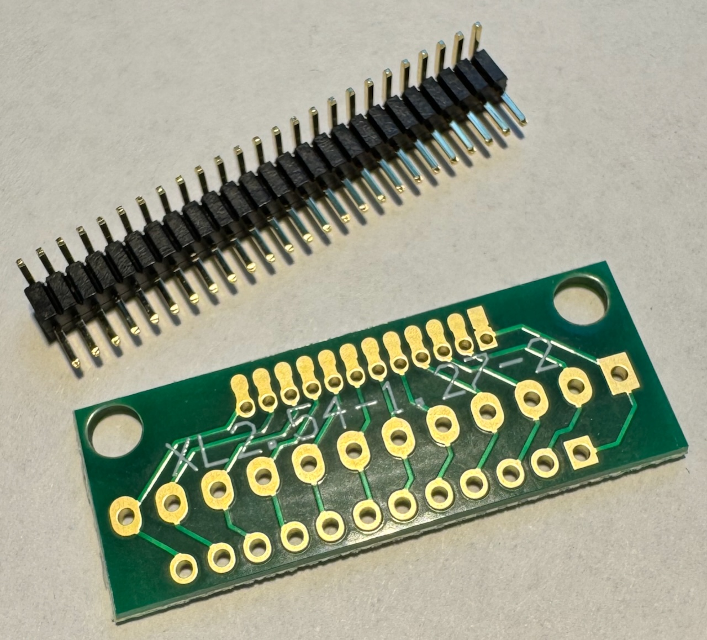
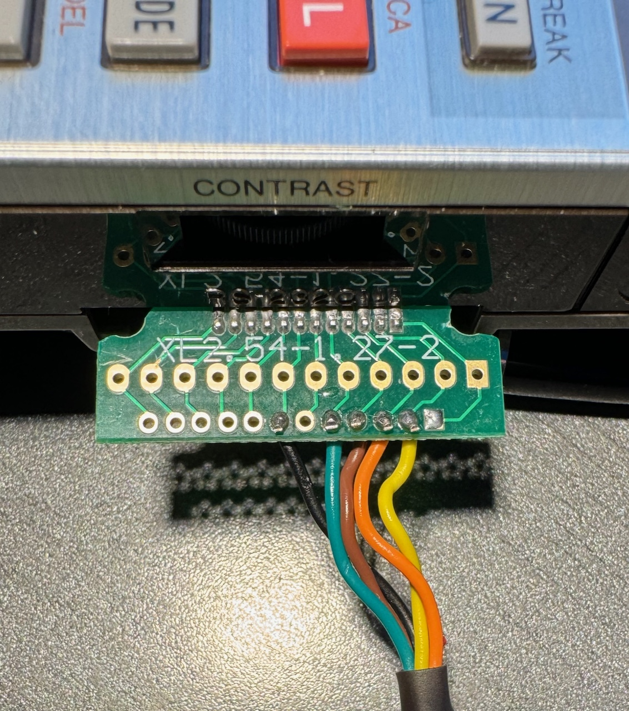

# Sharp Pocket Computer Communicator
## Hardware
### USB Serial Adapter for the PC-1600

The simplest approach is to use a serial to usb adapter. If the adapter uses an 
original FTDI chip, then no additional logic chips are required. These are the
components that I used:
* 1mm pins, bent 90 degrees
* A small board for soldering the pins. Search for "1.27mm 2.54mm Adapter Board" on the merchant site of your choice. I found no 15 pin boards, but 12 pins are enough.
* USB/UART cable, I used this one: "FTDI TTL-232R-5V-WE", i.e. 5V logic and wire ends.

Before the USB / UART adapter can be used, it needs to be reprogrammed using a Windows
machine. The signals of the RX, TX, RTS and CTS pins need to be inverted. This
can be done with a utility provided by FTDI, and is not covered in this README.
This is a one time operation, because the change is persistent even after
unplugging the cable.

The wiring is as follows (pin 1 is the rightmost pin of the PC-1600's 15-pin serial connector):

| Pin | Signal PC-1600 | Connect this cable of the USB/UART | USB/UART wire color |
|-----|----------------|------------------------------------|---------------------|
| 2   | TX             | RX                                 | yellow              |
| 3   | RX             | TX                                 | orange              |
| 4   | RTS            | CTS                                | brown               |
| 5   | CTS            | RTS                                | green               |
| 7   | TX             | Ground                             | black               |
Note: Do not connect the red cable (5V) of the adapter. I simply cut the cable off.



Note that I had to trim the edges of the board, because it would not have fit otherwise:



#### Problem with M1 Mac
On a Mac with the Apple Silicon chip, the USB UART Adapter does not work as it should,
probably due to a bug in the driver. The protocol that is used for flow control
is "RTC/CTS". In this, the sender (i.e. the Mac) requests to send a byte by raising
the RTS line ("request to send"). Then it is supposed to wait until the receiver
(the PC-1600) acknowledges readiness by raising the CTS line ("clear to send").
However, the Mac does not wait and starts to send right away, and the data
is lost. The other direction (PC-1600 to Mac) works fine.

As a workaround, I build the jar on the Mac and send it to a Raspberry Pi via `scp`.
The PC-1600 is connected to the Raspberry Pi, and sending / receiving happens
on the Raspberry Pi via a remote `ssh` session from the Mac.

### CE-158X for the PC-1500/A

The PC-1500 does not have a serial port built in. There was an add-on from Sharp
called "CE-158" which provided a serial and a parallel port. Jeff Birt built a
modern equivalent of this add-on, and sells it under the name [CE-158X](https://www.soigeneris.com/ce-158x-serial-parallel-interface-for-sharp-pc-1500).
This software works with the USB port of this device. By default, the PC-1500
uses the serial port of the CE-158X. In order to switch to the USB Port, enter
`SETDEV U1,CI,CO`. Then you can use e.g. `CLOADa` and use this application
to send a .bas file to the PC-1500.

## Software
### SharpCommunicator
The Sharp Communicator comes in the form of an executable JAR file. You need
to have Java installed (at least v17), and access to a command line.

The tool is launched as follows:

`java -jar SharpCommunicator.jar <options> [filename]`

The options are:
* `--load (-l)`: Load a file onto the PC-1500/1600. Before launching the tool, enter `LOAD "COM1:"` on the PC-1600, or `CLOADa` on the PC-1500.
* `--save (-s)`: Save a file from the PC-1500/1600 to the PC. Launch the tool, and then enter `SAVE "COM1:"` on the PC-1600, or `CSAVEa`on the PC-1500.
* `--1500 (-5)`: Setup the tool to communicate with the PC-1500 (default is the PC-1600)
* `--addutil (-u)`: Adds some shortcuts starting with line 61000 (Def-J: Init serial; Def-S: Save, Def-L: Load)

A file with the extension `.bas` will be automatically converted into the proper PC-1600 format, and no manual work is required.
Any other extension (e.g. `.img`) is sent to the PC-1600 unchanged.

### Settings for the Sharp PC-1600 serial port
After a reset / power loss of the PC-1600, these commands need to be entered
to make it ready for receiving data:
```
SETCOM "COM1:",9600,8,N,1,N,N
INIT "COM1:",4096
OUTSTAT "COM1:"
RCVSTAT "COM1:",24
```

For sending, this is required in addition (adapt `PCONSOLE` to your needs):
```
SNDSTAT "COM1:",24
SETDEV "COM1:",PO
PCONSOLE "COM1:",80,2
```

### Settings for the Sharp PC-1500 serial port
To switch to the USB port, enter this: `SETDEV U1,CI,CO`

## Reference Section
### PC/1600 commands relevant to serial communication
#### INIT
Sets the receive buffer size. Default is 40 bytes after power on.

`INIT "COM1:" <buffer>`
* buffer: Size of the buffer in bytes.

Example: `INIT "COM1:",4096`

#### SETCOM
Sets the protocol settings for the serial port.

`SETCOM "COM1:",[BR],[WL],[PR],[ST],[XO],[SI]`
* BR: Baud rate (50 - 38400)
* WL: Word length (5-8 bits)
* PR: Parity (E, O, N)
* ST: Stop Bits (1 or 2)
* XO: XON / XOFF (X = Yes, N = no)
* SI: Shift in/out protocol (S = yes, N = no)

Example: `SETCOM "COM1:", 9600,8,N,1,N,N`

#### OUTSTAT
Force-sets the state of the control signals for the serial port.

`OUTSTAT "COM1:" [,setting]`
* setting means:

|   | RTS  | DTR  |
|---|------|------|
| 0 | high | high |
| 1 | high | low  |
| 2 | low  | high |
| 3 | low  | low  |

Example: `OUTSTAT "COM1:"`, i.e. without setting, to make RTS/DTR work
dynamically.

#### INSTAT
Returns the current settings of the control signals for the serial port.

`INSTAT "COM1:"`

The state is returned as an integer, with each bit representing a signal.
Values are inversed, i.e. `0` means `high`, and `1` means `low`.

| Bit | 7      | 6      | 5  | 4   | 3  | 2   | 1   | 0   |
|-----|--------|--------|----|-----|----|-----|-----|-----|
|     | unused | unused | CI | DSR | CD | CTS | RTS | DTR |

Example: `PRINT INSTAT "COM1:"`: Prints the current state

#### SNDSTAT
Sets the send handshake protocol, and the timeout for the serial port.

`SNDSTAT "COM1:",<protocol>[,<timeout>]`
* Timeout is between 0 and 255, in units of 0.5 seconds. 0 disables the timeout.
* Protocol is as follows:

| Bit | 7   | 6   | 5   | 4   | 3  | 2   | 1   | 0   |
|-----|-----|-----|-----|-----|----|-----|-----|-----|
|     | n/a | n/a | n/a | DSR | CD | CTS | n/a | n/a |

* Bit = `1` means "ignore"
* Bit = `0` means "set high"

Examples:

* `SNDSTAT "COM1:",24`: Enables CTS (what we need for this project)
* `SNDSTAT "COM1:",28`: Disable all flow control.

#### RCVSTAT
Sets the receive handshake protocol and the timeout for the serial port

`RCVSTAT "COM1:",<protocol>[,<timeout>]`
* Timeout is between 0 and 255, in units of 0.5 seconds. 0 disables the timeout.
* Protocol is as follows:

| Bit | 7   | 6   | 5   | 4   | 3  | 2   | 1   | 0   |
|-----|-----|-----|-----|-----|----|-----|-----|-----|
|     | n/a | n/a | n/a | DSR | CD | CTS | n/a | n/a |

* Bit = `1` means "ignore"
* Bit = `0` means "must be high"

Examples:

* `RCVSTAT "COM1:",24`: Enables CTS handshake (what we need for this project)
* `SNDRCVSTAT "COM1:",28`: Disable all flow control.

Note: The manual mentions _Note that bits 1,2,6,7, and 8 are not used; set them to 0._  
However, most of the examples 
found online, and even in the manual itself, set one of more of these bits to 1. As a result, one can find
different numbers for "enable CTS", such as 59. This number also works, but 24 would be correct according to
the manual.

#### SETDEV
Specifies the serial port as input and output for some Basic commands.
`SETDEV` without parameters releases the port and resets input / optput to
keyboard / printer.

`SETDEV "COM1:"[,KI][,PO]`
* ,KI: Sets COM1: as device for the command `INPUT`.
* ,PO: Sets COM1: as device for the commands `LPRINT`, `LLIST` and `LFILES`.

Example: `SETDEV "COM1:",KI,PO`: Redirects both input and output to COM1

#### PCONSOLE
Set the line length and end of line code for communication through the serial port.

`PCONSOLE "COM1:",[line length],[EOL code]`
* Line length: 16-255 (0 means no limit)
* EL Code: 0 = CR, 1 = LF, 2 = CR/LF

Example: `PCONSOLE "COM1:",80,2`: Set the line length to 80 chars, and use CR/LF
(i.e. Windows style) for the line ending.

#### SAVE
Save a program via serial port.

`SAVE "<COM1:>"[,A]`
* A: ASCII format (instead of compressed binary format)

#### LOAD
Loads a program from serial port.

`LOAD "<COM1:>"[,R]`
* R: Auto-starts the program after loading.

## Future work
### Use a Raspberry Pi Pico instead of a USB / UART adapter
A Raspberry Pi Pico has a USB connector, serial pins, and 264k RAM. It should
therefore be possible to send a PC-1600 program via USB to the Raspberry Pi Pico
at full speed and buffer it in its RAM, and then the Pico sends the data to the
PC-1600 via its serial lines, using RTC/CTS flow control.

This should be cheaper than an USB / UART adapter, and it would work on a Mac as well.

Signal level adaption (3.3V vs. TTL) and signal inversion needs to be solved.
### Additional features
* Allow to specify the serial port. Important if the port can't be autodetected.
* Support `INPUT` from the PC to the PC-1600 (probably add to printer simulator)
* Print simulator: Support both codepages correctly (`MODE 0` and `MODE 1`)
* LOAD: Check for label or line number conflicts when adding the serial utils
