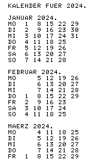

# PC-140x Basic Programs

## kalender.bas
This program prints a nice calendar on the printer (CE-126P).
I found this neat little application in a scan of an old magazine
[Alles für Sharp Computer No. 9](http://www.sharp-pc-1600.de/allesfuersharp/Alles_fur_Sharp_Computer_09.pdf?fbclid=IwZXh0bgNhZW0CMTAAAR2v_5nPV7Gm61JIea_PN8YTzIC0jiHkN43LmQJunYENUIg1gnqs5bPx7lw_aem_DD2XW_j0l_dhE0C7F00Pkg).
The program also runs unchanged on a PC-1261 / CE-125.

## kalender-1403.bas
The same program, utilizing small caps for a nicer printout. Small caps are available on the PC-1403(H),
unlike the PC-1401/2.