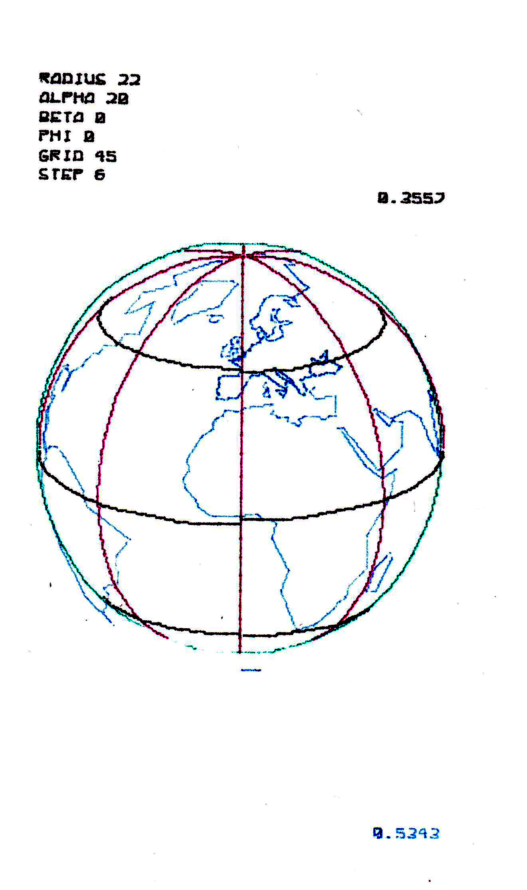

# PC-1500 Basic Programs
Most of the programs have been retrieved from this site: [Sharp PC-1500 (TRS-80 PC-2) resource page](http://www.pc1500.com/index.html).
One program is written by me: `utils.bas`.

## utils.bas
A collection of utils for the PC-1500(A). Very limited at the moment, to be used with a PC-1500A and a CE-163F memory module.

## bio.bas
The classical biorhythm program for the CE-150 plotter. Compared to the original, it is a bit spruced up in the
output.

## globe.bas
Plots a globe with the CE-150 plotter. Start with `Def-Z`.
For a quick success, use these parameters:
* Radius: 22
* Alpha: 20
* Beta: 0
* Phi: 0
* Grid: 45
* Step: 6
* Transparency: N

## commando.bas
I found this in a [Facebook post](https://www.facebook.com/groups/sharpcasioworld/posts/3807908649533793/).
So far I haven't figured out how it works. Here is an automated translation of the Japanese instructions:

### Story
My name is Command, a man who once participated in Vietnam. One day, my girlfriend was kidnapped by an organization. So I stood up to the organization alone.
### Content
Keys:
* 4 / 6: Left / Right
* 7 / 9: Left / Right
* 2 / 8: Crouch / Stand up
* 5: Use Sword

Please move the command and break the enemy's young land. Jump left and right in country 6, left and right in country 6. Put it in 2 and stand up at 8. You can't move when you're busy. I pretend to be in control with the national key. If there is joy next to you, you can defeat it. Also, the number on the left is damage, and if it is less than 0, one person will die. There are the first three commands. The damage increases when it collides with acid and when the handball is emitted near you. However, even if it is confirmed nearby, if you put it off, you can reduce the damage, and if you put it next to the first obstacle, you will not receive damage.

To a certain extent, if you go to the right (a little to the left of the building), the surface is clear. I was able to rescue her with 5 sides clear. The number of commands will increase by 1 person, and then it will be repeated by 1 to 5 sides.

## deskclock.bas
I found this nice program in an old German magazine. I translated it into English and moved it into the 21st century (the current year is hardcoded, and was set to 1986).
This is how it works:
* Def-A or "RUN" starts the program
* Down arrow stops it (if you BREAK out of it, type "UNLOCK" to re-enable the MODE key).
* Press and hold "S" to set the time,
* "B" to set/clear an hourly beep,
* "A" to enable/disable auto power off.

## donkey.bas
Untested so far.

## blackjack.bas
Untested so far.

## bathyscaph.bas
Untested so far.

